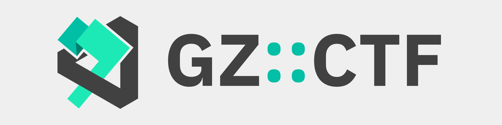

<picture>
  <source media="(prefers-color-scheme: dark)" srcset="assets/banner.dark.svg">
  
</picture>

# GZ::CTF

GZ::CTF 是一个基于 ASP.NET Core 的开源 CTF 平台。

## 关于本仓库

本仓库为 GZ::CTF 平台所使用动态容器的示例题目及相关模版。

## 题目编写提示

- 请勿在题目 Dockerfile 中使用 `EXPOSE` 暴露端口，因为 GZ::CTF 会自动将指定端口映射到主机的随机端口上，如果在 Dockerfile 中使用 `EXPOSE` 会导致一道题暴露多个端口，占用端口资源、留下安全隐患。
